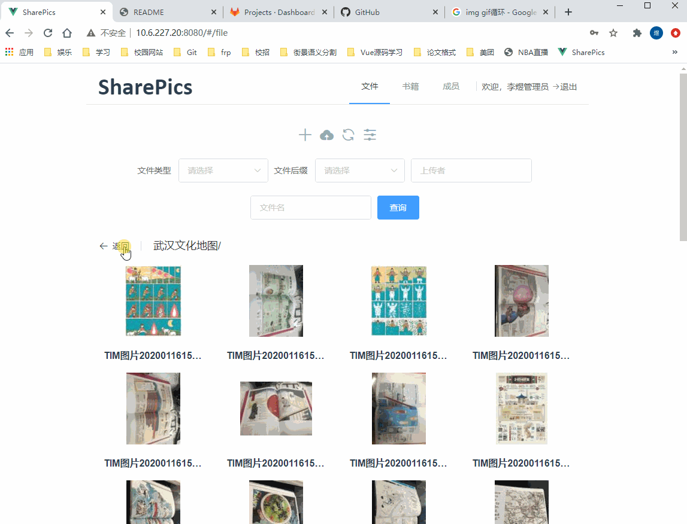

# sp-client

该项目是武大城市化研究室内网使用的`文件共享及图书管理系统`客户端SPA。通过访问网站不同的子页面，切换路由，渲染不同的子组件。App.vue是根组件，下面分四个子组件：登录子组件（Login.vue）、文件子组件（Project.vue）、书籍子组件（Book.vue）以及成员子组件（People.vue）。其中，书籍子组件下又分三个子组件：书架（Bookshelf.vue）、归还（Return.vue）、入库（Storage.vue）。成员子组件引用一个Member组件，但不绑定路由。如图5，每个组件右上角是对应的路由路径。

## 技术选型
- 前端框架：vue-cli3.11.0
- 组件库：element-ui2.4.5
- 网络请求：axios0.19.0
- 前端路由：vue-router3.1.3

## 相关博文
目前已在CSDN撰写7篇系列开发教程，文章目录见[这里](https://blog.csdn.net/lyandgh/article/details/104916962)

## 打赏
如果你觉得这个开源项目还不错，或者帮助到你，不妨给作者一点鼓励吧~

## 效果
### 登录注册

### 新建/删除文件夹

### 上传多图

### 文件路径切换

### 列表/缩略图模式切换

### 文件检索

### 书籍分页

### 书籍借阅/归还

### 书籍入库

## 问题汇总

|id|problem|solution|
|:--|:--|:--|
|1|用户问题，上传文件无法修改文件名，所以需要在刷新接口中确定用户当前的路径，这就需要区分用户。另外，多个用户同时使用是否会阻塞？线程问题。|formdata增加路径参数pathname|
|2|上传文件功能完成，待完善||

## Log

|date|update|
|:--|:--|
|20190926|1. 实现文件夹创建功能|
|20190927|1. 实现文件上传功能|
|20190928|1. 图片预览图获取，多文件上传|
|20190929|1. 图片预览功能，hover属性|
|20191001|1. 图片下载功能实现|
|20191007|1. 文件和文件夹删除s实现|
|20191008|1. 文件搜索功能完成，增加书籍和成员两个路由 2. 使用嵌套路由 3. 安装MongoDB|
|20191011|1. 初步实现用户登录，刷新和重新打开页面存在问题，需解决|
|20191012|1. 将静态文件系统集成数据库统计，包括创建、删除下载文件和文件夹功能 2. 删除权限问题，待解决。是本人删除自己上传的文件？|
|20191013|1. 新增成员页|
|20191016|1. 书籍页面增加子路由，入库接口初步形成|
|20191017|1. 书籍入库页面基本完善，入库功能还未实现 2. 增加上传书籍封面功能 3. 考虑豆瓣图片是否加载过长问题|
|20191026|1. 书籍搜索查询页面，包括分页功能|
|20191027|1. 书籍借阅功能、书籍归还功能实现|
|20191028|1. 书籍模糊搜索（正则表达式） 2. 文件增加表格查看形式|
|20201025|开源|

